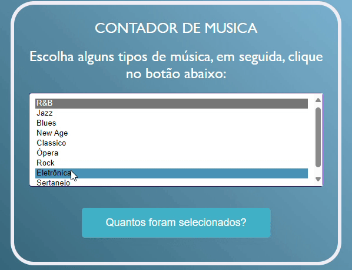

# Sistema de Contagem de Tipos de Música Selecionados

Estre ptojeto foi proposto por Leonardo Rocha, no qual o objetivo do trabalho é implementar o código dado como exemplo de laço de repetiçãone melhorá-lo incluindo mais 3 gêneros musicais.
# Resultado do projeto

O projeto é um exemplo de como contar os tipos de música selecionados por um usuário em um formulário web.

## Funcionalidades

- Permite que os usuários escolham vários tipos de música em um formulário HTML.
- Calcula o número de opções selecionadas quando o usuário clica em um botão.
- Exibe o total de opções selecionadas em um alerta.

## Tecnologias Utilizadas

- HTML
- CSS
- JavaScript
- Java

## Estrutura do Projeto

- `index.html`: Contém o formulário HTML e a lógica JavaScript para contagem.
- `styles.css`: Folha de estilo CSS para estilizar o formulário.
- `script.js`: Arquivo JavaScript para manipulação do formulário e cálculo da contagem.
- Outros arquivos: Quaisquer outros arquivos adicionais necessários para o projeto.

## Como Utilizar

1. Faça um clone deste repositório.
2. Abra o arquivo `index.html` em seu navegador web.
3. Selecione os tipos de música desejados no formulário.
4. Clique no botão "Quantos foram selecionados?".
5. Um alerta será exibido com o total de opções selecionadas.

## Contribuição

Contribuições são bem-vindas! Sinta-se à vontade para abrir uma issue ou enviar um pull request com melhorias ou correções.

